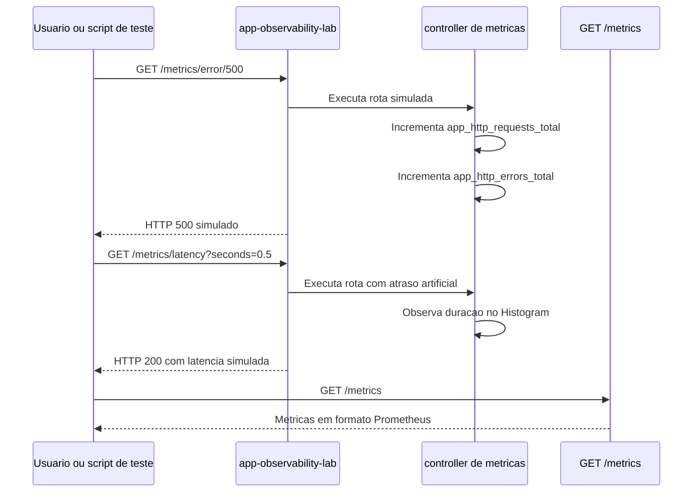

# Aplicação app-observability-lab: Métricas

Este guia explica como a aplicação `app-observability-lab` foi instrumentada para expor métricas.

A infraestrutura com Docker Compose, Prometheus e Grafana está descrita em [Infraestrutura de Métricas](infraestrutura-metricas.md).

## Conceito SRE

Métricas respondem perguntas como:

- quanto aconteceu?
- com que frequência aconteceu?
- quão rápido ou lento está?
- em que estado o sistema está agora?

Diferente de logs, que contam eventos individuais, métricas criam séries temporais. Isso ajuda a observar tendência, degradação, taxa de erro, latência e sinais que podem virar SLOs e alertas.

## Fluxo

```text
Aplicação Go
  -> instrumentação no controller
  -> GET /metrics
```

A aplicação não envia métricas diretamente para o Prometheus. Ela mantém os valores em memória e expõe o endpoint `/metrics`.

Diagrama de sequência:



## Tipos de Métrica

**Counter**: contador acumulado. Só aumenta.

Exemplo no laboratório:

```text
app_http_requests_total
app_http_errors_total
app_orders_created_total
```

**Gauge**: valor atual, que pode subir ou descer.

Exemplo no laboratório:

```text
app_http_active_requests
```

**Histogram**: distribuição de valores em buckets. É útil para latência.

Exemplo no laboratório:

```text
app_http_request_duration_seconds
```

**Summary**: também mede distribuição, mas com tradeoffs diferentes. Nesta primeira versão usamos Histogram, que costuma ser mais didático para Prometheus e Grafana.

## Arquivos

- `apps/app-observability-lab/controllers/metrics.go`: registra métricas customizadas, expõe `/metrics` e cria rotas de simulação.
- `scripts/generate-requests.sh`: gera requisições recorrentes para alimentar as métricas.

Resumo da estrutura:

```text
apps/app-observability-lab/controllers/metrics.go
  -> cria Counters, Gauge e Histogram
  -> registra as metricas com prometheus.MustRegister
  -> expoe GET /metrics com promhttp.Handler
  -> cria rotas didaticas para latencia, erros e pedidos

scripts/generate-requests.sh
  -> chama rotas de erro, latencia e pedidos em loop
  -> permite trocar BASE_URL, ERROR_CODES e SLEEP_SECONDS
```

## Rotas

### Endpoint de coleta

```text
GET /metrics
```

É a rota lida pelo Prometheus. Ela expõe métricas customizadas da aplicação e métricas padrão do Go.

Exemplo:

```bash
curl "http://localhost:8080/metrics"
```

### Demo do pilar

```text
GET /metrics/demo
```

Confirma que o pilar de métricas está ativo.

```bash
curl "http://localhost:8080/metrics/demo"
```

### Simular latência

```text
GET /metrics/latency?seconds=0.3
```

Gera uma resposta com atraso artificial para alimentar o Histogram de latência.

```bash
curl "http://localhost:8080/metrics/latency?seconds=0.5"
```

### Simular erro HTTP

```text
GET /metrics/error/:status
```

Gera respostas de erro entre `400` e `599`.

```bash
curl "http://localhost:8080/metrics/error/500"
curl "http://localhost:8080/metrics/error/404"
curl "http://localhost:8080/metrics/error/400"
```

### Simular métrica de negócio

```text
POST /metrics/orders
```

Incrementa o contador de pedidos simulados.

```bash
curl -X POST "http://localhost:8080/metrics/orders"
```

## Gerar Métricas de Teste

Execute:

```bash
./scripts/generate-requests.sh
```

Parâmetros:

```bash
ERROR_CODES="500 400" SLEEP_SECONDS=2 ./scripts/generate-requests.sh
```

```bash
BASE_URL="http://localhost:8080" ERROR_CODES="500 503 404" ./scripts/generate-requests.sh
```

Este script não é um DDoS. Ele apenas gera requisições recorrentes para estudo local.

## Consultas PromQL

Total de requisições por rota, método e status:

```promql
app_http_requests_total
```

Taxa de requisições por segundo:

```promql
sum(rate(app_http_requests_total[1m]))
```

Taxa por rota:

```promql
sum by (route) (rate(app_http_requests_total[1m]))
```

Total de erros por status:

```promql
sum by (status) (app_http_errors_total)
```

Taxa de erros por segundo:

```promql
sum by (status) (rate(app_http_errors_total[1m]))
```

Percentual de respostas 500:

```promql
100 * sum(rate(app_http_errors_total{status="500"}[1m])) / sum(rate(app_http_requests_total[1m]))
```

Percentual de respostas 4xx:

```promql
100 * sum(rate(app_http_errors_total{status=~"4.."}[1m])) / sum(rate(app_http_requests_total[1m]))
```

Latência p95:

```promql
histogram_quantile(0.95, sum by (le) (rate(app_http_request_duration_seconds_bucket[5m])))
```

Latência p95 por rota:

```promql
histogram_quantile(0.95, sum by (route, le) (rate(app_http_request_duration_seconds_bucket[5m])))
```

Requisições em andamento:

```promql
app_http_active_requests
```

Pedidos simulados por minuto:

```promql
sum(rate(app_orders_created_total[1m])) * 60
```

Métricas padrão do Go:

```promql
go_goroutines
go_memstats_alloc_bytes
process_cpu_seconds_total
process_resident_memory_bytes
```

## Cardinalidade

Labels bons para este laboratório:

```text
method
route
status
```

Evite labels com muitos valores diferentes:

```text
user_id
order_id
request_id
ip
```

Alta cardinalidade aumenta o número de séries temporais e pode prejudicar armazenamento, desempenho e consultas.
